# Commentator

Eine native Android-App zur Moderation von WordPress-Kommentaren.

Commentator ist kein WordPress-Reader und kein Ersatz für das Backend. Es ist
ein Werkzeug für genau eine Aufgabe: die täglichen Kommentare sichten,
genehmigen, ablehnen, beantworten – schnell, vom Telefon aus, ohne den Umweg
über die Weboberfläche. Auch für mehrere Blogs nebeneinander.

---

## So sieht es aus

<p>
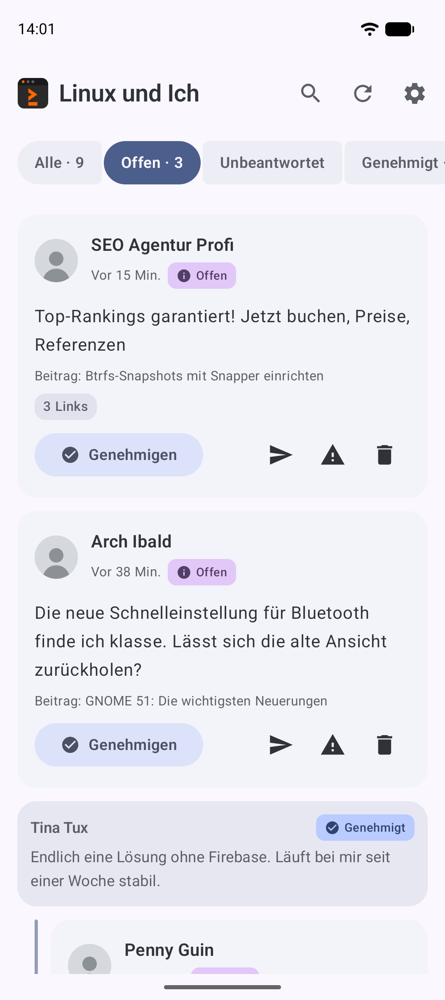
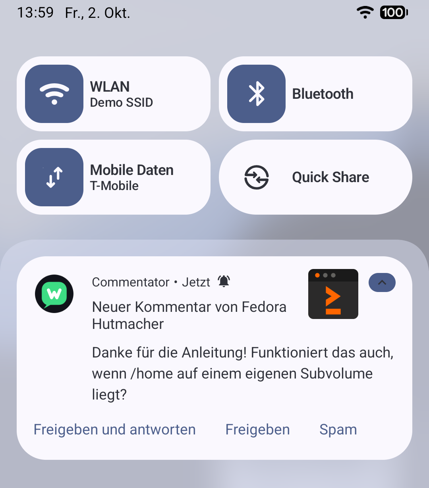
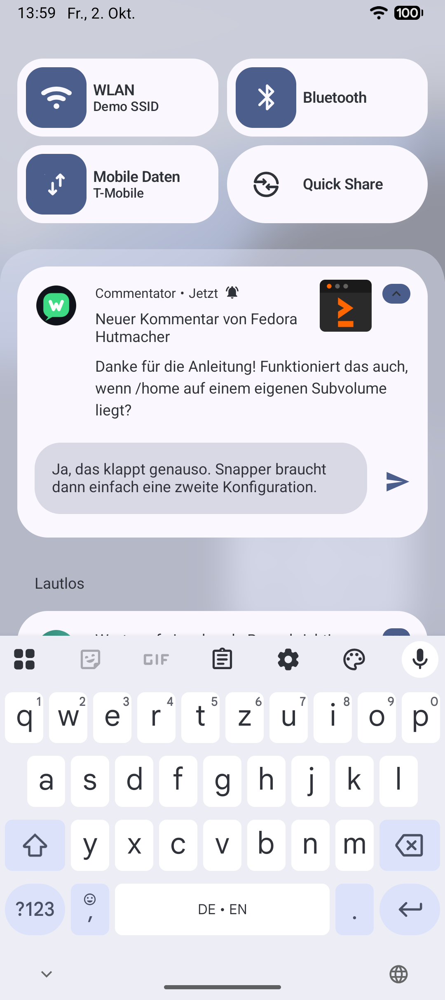
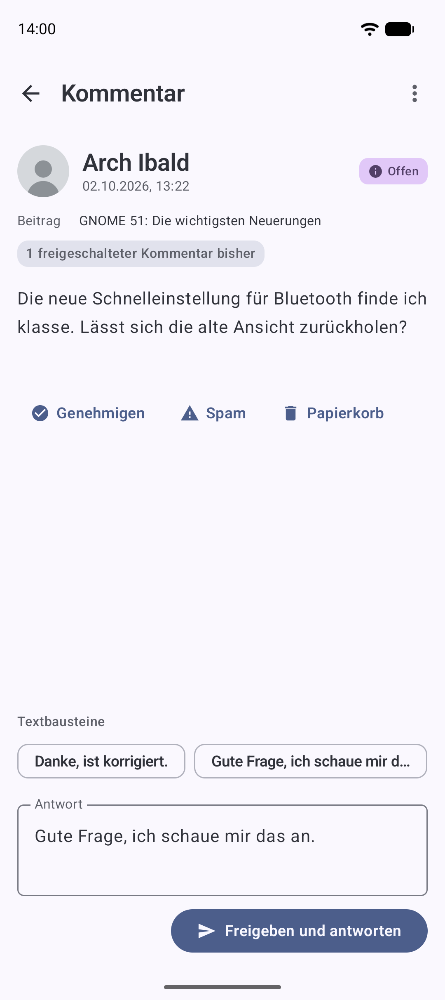
</p>
<p>
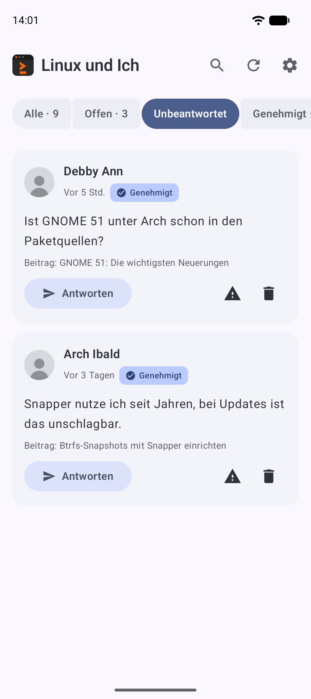
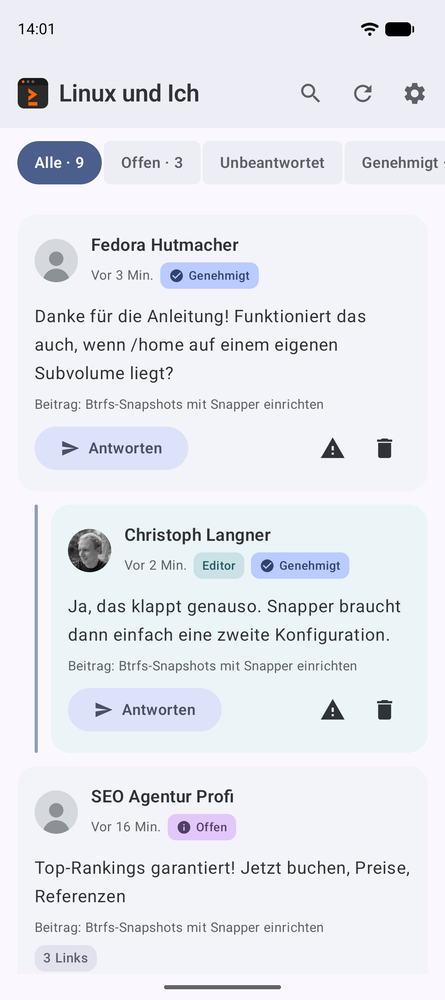
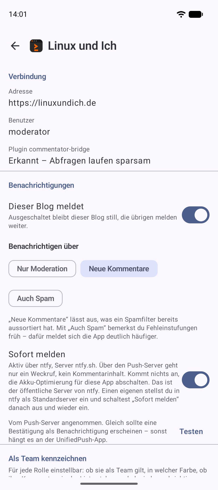
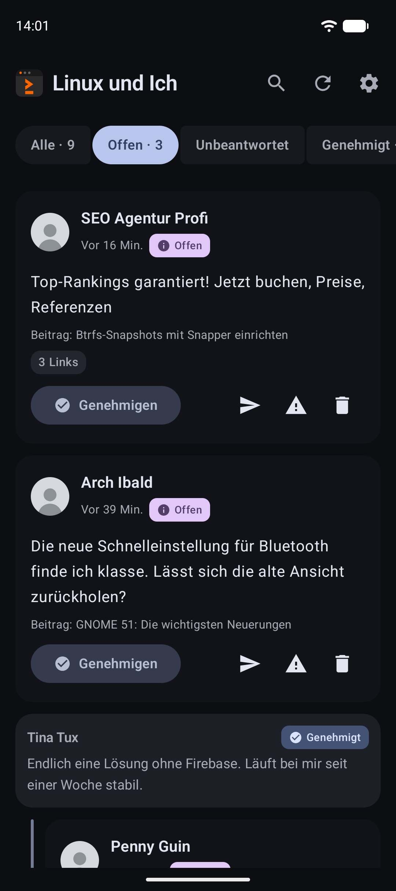
</p>

**Video (44 s):** Spam aussortieren, ein neuer Kommentar kommt per Push,
lesen, freigeben, antworten – und auf die Rückfrage direkt aus der
Benachrichtigung antworten.

<a href="docs/screenshots/demo-moderation.mp4">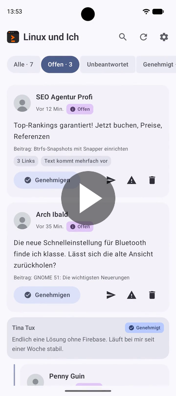</a>

Die Aufnahmen zeigen den Blog linuxundich.de mit erfundenen Kommentaren aus
einer lokalen Testumgebung; wie sie entstehen, steht in
[`docker/README.md`](docker/README.md#screenshots-und-demo-video).

---

## Für wen ist das gedacht?

Für Leute, die einen oder mehrere eigene WordPress-Blogs betreiben, dort
regelmäßig Kommentare bekommen und diese nicht über `wp-admin` auf einem
Mobilbildschirm moderieren wollen. Die App verlangt kein Konto bei einem
Dienst, keine App-Store-Anmeldung und keinen Server des Entwicklers – nur die
eigene WordPress-Installation.

---

## Funktionen

### Kommentare sichten

* Kommentare über die offizielle WordPress-REST-API abrufen
* Übersichtliche Liste mit Autor, Zeitpunkt, Text, zugehörigem Beitrag und
  Status
* Filter: Alle, Offen, Unbeantwortet, Genehmigt, Spam, Papierkorb; der
  zuletzt gewählte wird gemerkt
* „Unbeantwortet“ zeigt freigegebene Kommentare von Lesern, unter denen noch
  keine Antwort aus dem Team steht. WordPress kennt diesen Zustand nicht; die
  App ermittelt ihn aus den geladenen Seiten und nennt deshalb keine Zahl
* Optional Avatare (standardmäßig aus, siehe Datenschutz)
* Umschaltbares App-Symbol (grün oder blau)
* Pull-to-Refresh und Aktualisieren über die Kopfleiste
* Seitenweises Nachladen, auch bei Blogs mit vielen Kommentaren
* Lokaler Zwischenspeicher: Die Liste ist sofort da, auch ohne Verbindung

### Mehrere Blogs

* Beliebig viele WordPress-Blogs in einer App
* Umschalter in der Kopfleiste, ab dem zweiten Blog; nennt zu jedem Blog
  Symbol, Name, Adresse und die Zahl der offenen Kommentare
* Eigene Einstellungen je Blog: ob er benachrichtigt und worüber, seine Rollen
  und Farben, seine Textbausteine
* Ein Blog lässt sich einzeln entfernen, die übrigen bleiben unberührt
* Eine angetippte Benachrichtigung wechselt zum betreffenden Blog

### Moderieren

* Genehmigen
* Auf „ausstehend“ zurücksetzen
* Als Spam markieren
* In den Papierkorb verschieben
* Endgültig löschen (mit Rückfrage)
* Kommentartext bearbeiten, sofern das Konto es darf
* Jede zurücknehmbare Aktion bietet direkt „Rückgängig“ an
* Freigeben und als Spam markieren auch direkt aus der Benachrichtigung

### Antworten

* Antwort direkt aus der Detailansicht schreiben
* Veröffentlichung als echter WordPress-Kommentar mit Bezug auf den
  ursprünglichen Kommentar
* Antwort auf einen noch offenen Kommentar gibt diesen zuerst frei
  („Freigeben und antworten“), wie im WordPress-Backend – sonst bliebe die
  Antwort auf der Website unsichtbar
* Antworten auch direkt aus der Benachrichtigung, mit Texteingabe in der
  Benachrichtigung selbst
* Rückmeldung bei Erfolg, verständliche Fehlermeldung bei Problemen

### Benachrichtigungen

* Hinweis auf neue moderationsbedürftige Kommentare, auch wenn die App
  geschlossen ist
* Antippen öffnet unmittelbar den betreffenden Kommentar
* Knöpfe in der Benachrichtigung: „Antworten“ (bei offenen Kommentaren
  „Freigeben und antworten“), „Freigeben“ und „Spam“. Scheitert eine Aktion,
  bleibt die Benachrichtigung stehen und nennt den Grund
* Benachrichtigungen räumen sich auf: Wird ein Kommentar in der App
  moderiert, beantwortet oder geöffnet, verschwindet seine Meldung; wurde er
  im Web moderiert, gleicht die nächste Prüfung das ab
* Das Symbol des Blogs steht als Bild in jeder Benachrichtigung
* Optional Sofortmeldung über UnifiedPush (etwa mit ntfy), ohne Google; siehe
  unten
* Getrennte Benachrichtigungskanäle, einzeln über die Android-Systemeinstellungen
  steuerbar
* Kein Kommentar wird zweimal gemeldet
* Über die eigenen Beiträge meldet die App voreingestellt nicht; im Dialog
  **Eigenes Konto** lässt sich das einschalten
* Prüfintervall einstellbar

### Sonstiges

* Material 3, Dynamic Color, heller und dunkler Modus nach Systemeinstellung
* Deutsch und Englisch
* Keine Werbung, keine Analytics, keine Telemetrie

---

## Voraussetzungen

### Gerät

* Android 8.0 (API 26) oder neuer

### WordPress

* WordPress 5.6 oder neuer (für Application Passwords)
* **HTTPS ist zwingend.** Ohne gesicherte Verbindung bietet WordPress keine
  Application Passwords an, und die App lässt Klartextverkehr grundsätzlich
  nicht zu.
* Die REST-API muss erreichbar sein (`https://<blog>/wp-json/`). Manche
  Sicherheits-Plugins sperren sie.
* Das verwendete Konto braucht die Berechtigung `moderate_comments`
  (Rolle Redakteur oder Administrator). Ohne sie richtet die App die
  Verbindung zwar ein, sperrt aber alle Moderationsaktionen.

### Optional: Plugin `commentator-bridge`

Nicht erforderlich. Es macht die regelmäßige Prüfung auf neue Kommentare
deutlich sparsamer, indem es drei Zahlen statt einer vollständigen
Kommentarliste liefert. Außerdem bringt es Endpunkte für das Team, für „Spam
leeren“ und „Papierkorb leeren“ in einer Anfrage und für die Sperrliste mit.
Ab Version 1.5 ermöglicht es die Sofortmeldung über UnifiedPush. Ohne das
Plugin funktioniert die App vollständig.

### Push-Infrastruktur

**Wird nicht benötigt.** Es gibt kein Firebase, keinen Vermittlungsserver und
keine Google Play Services. Die Begründung für diese Entscheidung und der
Vergleich mit den Alternativen stehen in
[`docs/architecture.md`](docs/architecture.md#9-benachrichtigungen-über-neue-kommentare).

Wer neue Kommentare in Sekunden statt bei der nächsten Prüfung gemeldet haben
möchte, kann je Blog die **Sofortmeldung über UnifiedPush** einschalten. Dafür
braucht es eine UnifiedPush-App auf dem Telefon, etwa ntfy, und auf dem Blog
das Plugin ab Version 1.5. Das Plugin schickt bei jedem neuen Kommentar nur
einen inhaltslosen Weckruf über den Push-Server; die Kommentare holt die App
danach wie gewohnt selbst vom Blog. Der Push-Server erfährt dabei nur, dass
und wann kommentiert wurde.

---

## Einrichtung

### 1. WordPress vorbereiten

1. Sicherstellen, dass der Blog über HTTPS erreichbar ist.
2. `https://<blog>/wp-json/` im Browser aufrufen. Es muss JSON erscheinen.
   Kommt stattdessen eine Fehlerseite, blockiert etwas die REST-API.
3. Ein Konto mit der Rolle Redakteur oder Administrator bereithalten.

### 2. Optional: Plugin installieren

```bash
cp -r wordpress-plugin/commentator-bridge <wordpress>/wp-content/plugins/
```

Anschließend im Backend unter „Plugins“ aktivieren. Die App erkennt es
automatisch und weist in den Einstellungen darauf hin.

Wird das Plugin erst nachträglich installiert, bemerkt die App das beim
nächsten Aktualisieren des Posteingangs oder sobald die Einstellungen geöffnet
werden. Eine erneute Anmeldung ist nicht nötig.

### 3. Zugangsdaten erzeugen

Der bequeme Weg läuft über die App selbst – Schritt 4 übernimmt das.

Manuell geht es so: In WordPress unter **Benutzer → Profil → Application
Passwords** einen Namen eingeben, etwa „Commentator Android“, und das erzeugte
Passwort notieren. Es wird nur einmal angezeigt.

Das Kontokennwort wird dafür nicht gebraucht und gehört auch nicht in die App.

### 4. App einrichten

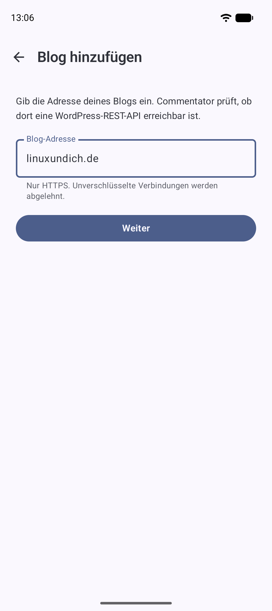

1. App starten.
2. Blog-Adresse eingeben, etwa `https://example.com`. Die App prüft, ob dort
   eine WordPress-REST-API erreichbar ist.
3. **In WordPress autorisieren** wählen. Es öffnet sich der Browser mit der
   Autorisierungsseite der eigenen Installation. Dort anmelden und bestätigen.
4. WordPress springt zurück in die App, die das erhaltene Application Password
   sofort prüft und verschlüsselt ablegt.

Bietet die Installation den Autorisierungs-Flow nicht an, führt
**Application Password manuell eingeben** zum selben Ergebnis – dann mit dem
in Schritt 3 erzeugten Passwort.

### 5. Weitere Blogs hinzufügen

**Einstellungen → Blogs → Weiteren Blog hinzufügen** führt durch dieselben
Schritte. Jeder Blog braucht sein eigenes Application Password; die App legt
für jeden eigene Zugangsdaten und einen eigenen Zwischenspeicher an.

Ab dem zweiten Blog wird der Name in der Kopfleiste des Posteingangs zum
Umschalter. Wer sich bei einem bereits eingerichteten Blog erneut anmeldet,
tauscht dessen Zugangsdaten aus – es entsteht kein zweiter Eintrag.

### 6. Benachrichtigungen einrichten

Beim ersten Start fragt die App die Berechtigung für Benachrichtigungen ab
(ab Android 13). In den App-Einstellungen lassen sich der Hauptschalter für
Benachrichtigungen und das Prüfintervall festlegen; die Feineinstellung je
Kanal erfolgt in den Android-Systemeinstellungen, die aus der App heraus
verlinkt sind.

Ob ein einzelner Blog meldet und worüber, steht in seinen eigenen
Einstellungen unter **Einstellungen → Blogs → <Blogname>**. Ein Nebenprojekt
kann so still bleiben, während der Hauptblog meldet.

Das kürzest mögliche Intervall sind 15 Minuten – das ist die Untergrenze von
WorkManager für periodische Arbeit. Es gilt für den Durchgang über alle Blogs
gemeinsam: Sie werden in einem Lauf geprüft, damit das Gerät nur einmal
aufwacht.

Schneller geht es mit **Sofort melden** in den Einstellungen des jeweiligen
Blogs. Voraussetzungen sind eine UnifiedPush-App auf dem Telefon (etwa ntfy)
und das Plugin `commentator-bridge` ab Version 1.5 auf dem Blog. Beim
Einschalten meldet sich die App bei der UnifiedPush-App an und hinterlegt die
erhaltene Adresse beim Plugin. Die Zeile nennt anschließend, über welche App
die Meldungen kommen, oder warum es nicht geklappt hat – etwa weil das Plugin
zu alt ist. Die regelmäßige Prüfung läuft weiter und holt ein, was auf dem
Push-Weg verloren gegangen ist. Beim Ausschalten oder Entfernen des Blogs wird
die Adresse beim Plugin wieder zurückgenommen.

Wichtig: Die UnifiedPush-App braucht eine Ausnahme von der Akku-Optimierung.
Ohne sie verweigert Android ihr ab Version 15 den Dienst im Hintergrund, und
Weckrufe kommen erst an, wenn sie das nächste Mal geöffnet wird. ntfy weist
beim ersten Start selbst darauf hin. Mit Ausnahme kam eine Meldung im Test
rund eine halbe Sekunde nach dem Kommentar an.

Ohne weiteres läuft das über den öffentlichen Server ntfy.sh. Ein eigener
ntfy-Server geht ebenso: In der ntfy-App als Standardserver eintragen, dann
„Sofort melden“ aus- und wieder einschalten; die App holt sich dabei eine neue
Adresse und nennt den Server in der Einstellungszeile. Zwei Bedingungen: Der
Server muss öffentlich per HTTPS erreichbar sein, denn das Plugin lehnt
Adressen im lokalen Netz ab. Und er muss **vom Blog-Server aus** erreichbar
sein – ein Server, der nur per IPv6 erreichbar ist (typisch hinter
Carrier-Grade-NAT), hilft nichts, wenn das Hosting des Blogs nur IPv4 kann.

Ob der Weg trägt, zeigt **Testen** unter „Sofort melden“: Das Plugin schickt
einen Testweckruf, und kommt er an, erscheint die Benachrichtigung
„Sofortmeldung funktioniert“. Im WordPress-Profil steht im Abschnitt
„Commentator: Sofortmeldung“, wohin der Blog Weckrufe schickt, mit
„Entfernen“ und demselben Test (ab Plugin 1.7.0).

Seit Plugin 1.6.0 weckt auch eine Moderation im Web: Die Benachrichtigung zu
einem dort erledigten Kommentar verschwindet dann sofort. Ist jeder
benachrichtigende Blog auf diese Weise angebunden, prüft die App nur noch alle
sechs Stunden als Sicherheitsnetz nach.

Die Knöpfe in den Benachrichtigungen erscheinen nur bei Konten, die
Kommentare moderieren dürfen.

### 7. App bauen

```bash
cd android
export JAVA_HOME=/usr/lib/jvm/java-21-openjdk    # Pfad je nach System
./gradlew assembleDebug
```

Das APK liegt danach unter
`android/app/build/outputs/apk/debug/app-debug.apk`.

### 8. App installieren

```bash
adb install -r android/app/build/outputs/apk/debug/app-debug.apk
```

---

## Entwicklung

### Werkzeuge

| Werkzeug | Version |
|---|---|
| JDK | 21 (Minimum 17) |
| Gradle | 9.7.1, über den mitgelieferten Wrapper |
| Android Gradle Plugin | 9.4.1 |
| Kotlin | 2.3.21 |
| Android SDK Platform | 37 (`platforms;android-37.0`) |
| Build Tools | 37.0.0 |
| Android Studio | Quail 4 (2026.1.4) oder neuer, optional |

Android Studio ist nicht erforderlich – das Projekt baut vollständig über die
Kommandozeile.

Unter Arch Linux:

```bash
sudo pacman -S --needed jdk21-openjdk
yay -S --needed android-sdk-cmdline-tools-latest android-sdk-platform-tools \
                android-sdk-build-tools android-platform
```

`android/local.properties` muss auf das SDK zeigen:

```properties
sdk.dir=/opt/android-sdk
```

Diese Datei gehört nicht ins Repository und steht in `.gitignore`.

### Build-Befehle

```bash
cd android

./gradlew assembleDebug          # Debug-APK
./gradlew assembleRelease        # Release-APK (siehe unten)
./gradlew testDebugUnitTest      # Unit- und UI-Tests auf der JVM
./gradlew connectedDebugAndroidTest   # Instrumentierungstests, Gerät nötig
./gradlew lint                   # Android Lint
./gradlew check                  # Lint und Tests zusammen
```

### Versionierung

Version und Buildnummer werden beim Bauen aus Git abgeleitet, nicht von Hand
gepflegt:

| | |
|---|---|
| `versionCode` | Anzahl der Commits (`git rev-list --count HEAD`) |
| `versionName` | Name des Tags auf `HEAD`, sonst `<Basisversion>-dev+<Anzahl>.g<Commit>` |

Die Basisversion steht als `COMMENTATOR_VERSION` in `gradle.properties` und
greift, solange kein Tag gesetzt ist. Liegt im Arbeitsbaum Uncommittetes, hängt
`.dirty` an.

Ohne Git – etwa beim Bauen aus einem Quellarchiv – greifen Rückfallwerte,
damit der Build nicht am fehlenden Werkzeug scheitert.

Der Bildschirm **Über diese App** zeigt beides zusammen mit dem Commit an, aus
dem der Build entstanden ist. Damit lässt sich eine Fehlermeldung eindeutig
einem Stand zuordnen.

### Datenbankschema

Room exportiert das Schema nach `android/app/schemas/`. Diese Dateien gehören
ins Repository: Nur mit ihnen lassen sich spätere Migrationen automatisiert
prüfen.

### Release-Build

```bash
./gradlew assembleRelease
```

Release-Builds verwenden R8 mit Code- und Ressourcenverkleinerung.

Das Repository enthält **weder Keystore noch Passwörter**. Die
Signaturkonfiguration liest vier Gradle-Properties, die außerhalb des
Projekts liegen müssen – in `~/.gradle/gradle.properties`:

```properties
COMMENTATOR_STORE_FILE=/home/<benutzer>/.android/commentator-release.p12
COMMENTATOR_STORE_PASSWORD=<Passwort>
COMMENTATOR_KEY_ALIAS=commentator
COMMENTATOR_KEY_PASSWORD=<Passwort>
```

Fehlt auch nur eine davon, entsteht ein **unsigniertes** Release statt eines
Build-Fehlers. Ein fremder Klon des Repositories baut also weiterhin, nur eben
ohne Signatur.

Einen passenden Schlüssel erzeugt man so:

```bash
keytool -genkeypair \
  -keystore ~/.android/commentator-release.p12 \
  -storetype PKCS12 -alias commentator \
  -keyalg RSA -keysize 4096 -validity 10950 \
  -dname "CN=<Name>, O=<Organisation>, C=DE"
chmod 600 ~/.android/commentator-release.p12
```

> **Der Schlüssel ist nicht ersetzbar.** Android erlaubt ein Update nur, wenn
> es mit demselben Schlüssel signiert ist wie die installierte Version. Geht
> er verloren, lässt sich die App nur deinstallieren und neu installieren –
> mit Verlust aller lokalen Daten. Keystore und Passwort gehören deshalb in
> eine Sicherung und in einen Passwortmanager, nicht ins Repository.

### Tests

| Ebene | Befehl | Inhalt |
|---|---|---|
| Unit | `./gradlew testDebugUnitTest` | Mapping, Statuslogik, Fehlerzuordnung, Use Cases, ViewModels |
| Netzwerk | dito | MockWebServer: Parameter, Paginierung, Fehlercodes, Auth-Kopfzeile |
| UI | dito | Compose-Tests über Robolectric: Liste, Filter, Moderation, Leer- und Fehlerzustände |
| Integration | siehe unten | Gegen eine lokale WordPress-Installation |

Es gibt keinen Testpfad, der auf einen produktiven Blog zeigt. Die
Integrationstests überspringen sich selbst, solange keine Umgebungsvariablen
gesetzt sind, und weigern sich abzulaufen, wenn die angegebene Adresse nicht
`localhost` oder `127.0.0.1` ist.

So laufen sie gegen die lokale Umgebung:

```bash
cd docker
./scripts/generate-cert.sh
docker compose up -d
./scripts/seed.sh          # gibt am Ende ein Application Password aus

cd ../android
COMMENTATOR_IT_URL=https://localhost:8443 \
COMMENTATOR_IT_USER=moderator \
COMMENTATOR_IT_PASSWORD='<das ausgegebene Passwort>' \
  ./gradlew :app:testDebugUnitTest --tests '*WordPressIntegrationTest'
```

Geprüft wird dabei der komplette Weg gegen eine echte WordPress-Installation:
Erkennung der REST-API, Anmeldung, Berechtigungen, Kommentarabruf,
Statuswechsel samt Zurücknahme, Antworten und der Endpunkt des Plugins. Die
Tests räumen hinter sich auf.

### Lokale WordPress-Testumgebung

```bash
cd docker
./scripts/generate-cert.sh
docker compose up -d
./scripts/seed.sh
```

Beenden:

```bash
docker compose down        # Daten bleiben erhalten
docker compose down -v     # alles verwerfen
```

Einzelheiten, auch zum Zugriff aus dem Emulator, stehen in
[`docker/README.md`](docker/README.md).

Statt Docker geht auch Podman. Dessen Socket ersetzt den Docker-Dienst, und
`docker-compose` spricht ihn über `DOCKER_HOST` an:

```bash
systemctl --user start podman.socket
export DOCKER_HOST=unix://$XDG_RUNTIME_DIR/podman/podman.sock
docker-compose up -d
```

### Emulator ohne Android Studio

So ließ sich ein Emulator unter Arch Linux allein mit den
Kommandozeilenwerkzeugen einrichten. Das SDK liegt dabei unter
`~/Android/Sdk`:

```bash
sdkmanager emulator platform-tools "platforms;android-37.0" "build-tools;37.0.0" \
           "system-images;android-37.0;google_apis_playstore;x86_64"

avdmanager create avd -n Pixel_10_API_37 \
  -k "system-images;android-37.0;google_apis_playstore;x86_64" -d pixel_10
```

API 37 entspricht Android 17. In `~/.android/avd/Pixel_10_API_37.avd/config.ini`
`hw.ramSize=4096` setzen, dann starten:

```bash
emulator -avd Pixel_10_API_37 -gpu host
```

Für die lokale Testumgebung muss der Emulator nicht über `10.0.2.2` gehen.
Einfacher ist es, den Port durchzureichen:

```bash
adb reverse tcp:8443 tcp:8443
```

Danach gilt `https://localhost:8443` für Rechner und Emulator gleichermaßen,
und `WP_SITE_URL` muss nicht gesetzt werden.

Das Testzertifikat kommt per `adb push docker/certs/server.crt /sdcard/Download/`
auf den Emulator und wird dort unter **Einstellungen → Sicherheit &
Datenschutz → Weitere Sicherheitseinstellungen → Verschlüsselung &
Anmeldedaten → Zertifikat installieren → CA-Zertifikat** installiert.

### Hintergrundprüfung sofort anstoßen

WorkManager zieht periodische Arbeit nicht vor; auf die nächste Prüfung zu
warten, kostet bis zu 15 Minuten. Der Debug-Build bringt deshalb einen
Empfänger mit, der sie sofort auslöst:

```bash
adb shell am broadcast \
  -n de.christophlangner.commentator.debug/de.christophlangner.commentator.notification.DebugSyncReceiver
```

`DebugSyncReceiver` existiert nur im Debug-Build und ist mit
`android.permission.DUMP` geschützt, also nur über `adb` erreichbar, nicht für
andere Apps.

---

## Architektur

Ausführlich in [`docs/architecture.md`](docs/architecture.md). In Kurzform:

```
UI (Compose, Material 3)
 ▼
ViewModel (StateFlow)
 ▼
Use Cases / Repository
 ▼
WordPress-API-Client (Retrofit) + Room-Cache + Keystore
 ▼
WordPress REST API
```

Die wichtigsten Festlegungen:

* **Room ist die einzige Quelle für die Anzeige.** Netzwerkantworten werden in
  die Datenbank geschrieben, die UI beobachtet die Datenbank. Deshalb ist der
  Offline-Fall kein Sonderfall.
* **Die UI kennt weder DTOs noch HTTP-Codes.** Beides wird in der Datenschicht
  in Domänenmodelle und eine geschlossene Fehlerhierarchie übersetzt.
* **Die WordPress-Instanz ist nie implizit.** Jede Datenbankzeile trägt eine
  `instanceId`, der HTTP-Client wird pro Instanz erzeugt, und Zugangsdaten
  liegen pro Instanz. Weil das von Anfang an so war, kam der Mehrfachbetrieb
  ohne Datenmigration aus.
* **Die Erkennung neuer Kommentare liegt hinter einer Schnittstelle.** Sie
  arbeitet per Polling. Die optionale Sofortmeldung über UnifiedPush ist nur
  ein Weckruf, der dieselbe Prüfung sofort anstößt – Benachrichtigungen, Deep
  Links und UI blieben dafür unberührt.

Verzeichnisse:

```
android/                Die App
wordpress-plugin/       Optionales Plugin commentator-bridge
docker/                 Lokale WordPress-Testumgebung
docs/                   Architektur, API-Nutzung, Datenschutz
```

---

## Sicherheit

* **Kein WordPress-Kennwort in der App.** Verwendet werden ausschließlich
  Application Passwords. Beim Autorisierungs-Flow wird das Kontokennwort nur
  im Browser eingegeben; die App bekommt es nie zu sehen. Ein Application
  Password lässt sich im WordPress-Profil einzeln widerrufen.
* **Verschlüsselte Ablage.** Das Application Password liegt als
  `AES-256-GCM`-Chiffrat in DataStore. Der Schlüssel steckt im Android
  Keystore und verlässt ihn nicht. `EncryptedSharedPreferences` wird bewusst
  nicht verwendet – die Bibliothek ist seit Mitte 2025 deprecated, und Google
  verweist auf genau diesen Weg.
* **Nur HTTPS**, erzwungen über Netzwerkkonfiguration, Manifest und einen
  eigenen Interceptor.
* **Keine Zugangsdaten in Logs.** HTTP-Logging existiert nur im Debug-Build
  und redigiert dort die `Authorization`-Kopfzeile. Die Typen für
  Zugangsdaten geben ihren Wert über `toString()` nicht preis; zwei Unit-Tests
  sichern das ab.
* **Keine Zugangsdaten in Screenshots.** Der Schritt zur manuellen Eingabe
  des Application Passwords setzt `FLAG_SECURE`; dort verweigert Android
  Screenshots und zeigt in der App-Übersicht keine Vorschau. Der übrige
  Einrichtungsablauf und die gesamte App bleiben fotografierbar.
* **Keine Zugangsdaten in Backups.** `allowBackup="false"` und leere
  Extraktionsregeln.
* **Keine Zugangsdaten im Repository.** Weder Keystores noch
  Signaturkonfiguration noch `local.properties` sind eingecheckt.

Umgang mit Kommentardaten: Sie enthalten personenbezogene Daten Dritter,
insbesondere E-Mail-Adressen. Sie liegen ausschließlich in der App-privaten
Datenbank, werden an niemanden weitergegeben und beim Abmelden vollständig
gelöscht. Die Anzeige der E-Mail-Adresse ist standardmäßig abgeschaltet.

---

## Datenschutz

Vollständig beschrieben in [`docs/privacy.md`](docs/privacy.md).

Die Kurzfassung: Die App baut Verbindungen ausschließlich zur konfigurierten
WordPress-Instanz auf. Die einzige mögliche Ausnahme sind Avatarbilder, die
bei einer Standardinstallation von Gravatar stammen – deshalb ist die Anzeige
von Avataren standardmäßig **aus**.

Wer die optionale Sofortmeldung einschaltet, bezieht zusätzlich einen
Push-Server ein: Das Plugin schickt bei neuen Kommentaren einen inhaltslosen
Weckruf dorthin, die UnifiedPush-App auf dem Telefon nimmt ihn entgegen. Die
App selbst verbindet sich auch dann nur mit dem eigenen Blog.

Es gibt keine Analytics, keine Absturzberichte, keine Telemetrie, keine
Werbung, keine Werbekennungen und keinen Server des Entwicklers. Die App
fordert selbst drei Berechtigungen an: `INTERNET`, `ACCESS_NETWORK_STATE`
und `POST_NOTIFICATIONS`. Im fertigen APK stehen drei weitere, die
`androidx.work` beim Zusammenführen der Manifeste beisteuert – `WAKE_LOCK`,
`RECEIVE_BOOT_COMPLETED` und `FOREGROUND_SERVICE`. Keine davon eröffnet
Zugriff auf Nutzerdaten; [`docs/privacy.md`](docs/privacy.md) führt jede
einzeln auf.

---

## Bekannte Einschränkungen

* **Keine Offline-Moderation.** Ohne Verbindung sind schreibende Aktionen
  gesperrt und als solche gekennzeichnet. Eine Warteschlange bräuchte eine
  Konfliktauflösung für zwischenzeitlich anderswo moderierte Kommentare; das
  halbfertig zu bauen wäre schlechter als es wegzulassen.
* **Benachrichtigungen mit Verzögerung.** Die Prüfung läuft periodisch,
  frühestens alle 15 Minuten. Schneller geht es nur mit der optionalen
  Sofortmeldung über UnifiedPush, die eine UnifiedPush-App auf dem Telefon und
  das Plugin ab 1.5 voraussetzt – die Abwägung steht in der
  Architekturdokumentation.
* **„Unbeantwortet“ ohne Zahl und nur über Geladenes.** Der Filter wirkt nur
  über die bereits geladenen Seiten; WordPress kann diesen Zustand nicht
  zählen.
* **Erster Lauf meldet nichts.** Beim allerersten Hintergrundlauf wird nur der
  Ausgangszustand festgehalten, damit nicht der gesamte vorhandene Rückstand
  als Benachrichtigungsflut ankommt.
* **Keine Mehrfachauswahl.** Sammelaktionen gibt es nur als „Spam leeren“ und
  „Papierkorb leeren“; eine Mehrfachauswahl steht im Backlog.
* **Gesprächsfaden nur eine Stufe tief.** Die Liste zeigt zu einer Antwort den
  unmittelbaren Bezug; den ganzen Faden zeigt die Detailansicht.
* **Kein gemeinsamer Posteingang.** Mehrere Blogs werden nacheinander über den
  Umschalter angezeigt, nicht in einer gemeinsamen Liste.
* **Papierkorb-Verhalten hängt von WordPress ab.** Ist der Papierkorb in der
  Installation abgeschaltet, löscht bereits die Papierkorb-Aktion endgültig.
  Die App kann das nicht auslesen und weist vor dem endgültigen Löschen
  ausdrücklich darauf hin.
* **Kommentarbearbeitung ist reines HTML.** Es gibt keinen Rich-Text-Editor;
  bearbeitet wird der gerenderte HTML-Text.
* **Instrumentierungstests brauchen ein Gerät.** Ohne Gerät oder Emulator
  laufen nur die JVM-Tests, die aber den Großteil abdecken. Der Lauf löscht die
  App-Daten auf dem Gerät; eine dort eingerichtete Verbindung muss danach neu
  aufgebaut werden.

---

## Symbol und Marken

Das App-Symbol ist eine eigene Zeichnung: eine Sprechblase – der Gegenstand
der App sind Kommentare – mit einem W darin, in flacher Geometrie. Es
verwendet **keine fremde Wort- oder Bildmarke** und kann deshalb bedenkenlos
veröffentlicht werden.

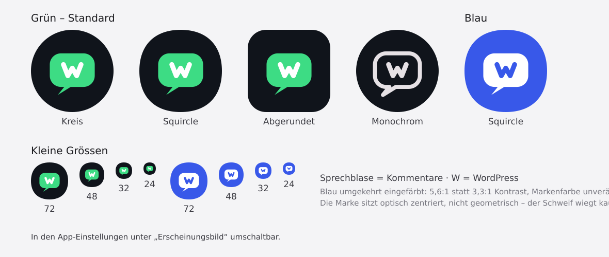

Es gibt zwei Farbvarianten, **in den App-Einstellungen unter „Erscheinungsbild"
umschaltbar**: Android-Grün und WordPress-Blau. Dahinter steckt je ein
`activity-alias` auf dieselbe Activity, von dem immer genau einer eingeschaltet
ist – einen direkten Weg, das Startsymbol zur Laufzeit zu ändern, kennt Android
nicht. Beim Umschalten legt der Startbildschirm den Eintrag neu an; ein selbst
platziertes Symbol muss danach unter Umständen neu abgelegt werden.

Für einen Play-Store-Eintrag liegt das Symbol zusätzlich als 512 × 512 px
großes PNG unter [`store/play/`](store/play/) – Google Play verlangt dort ein
anderes Format als Android für das Startsymbol. Die Prüfung gegen beide
Spezifikationen ist in [`store/play/README.md`](store/play/README.md)
festgehalten.

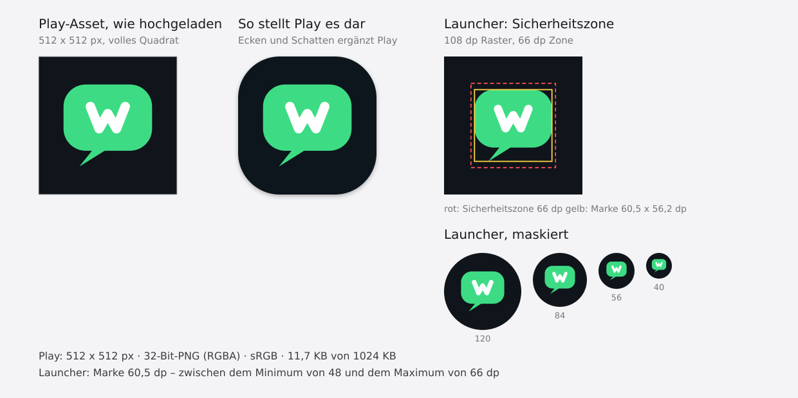

Die Quelldateien liegen unter
[`android/app/src/main/res/drawable/`](android/app/src/main/res/drawable/),
samt monochromer Variante für themenbezogene Symbole ab Android 13.

„WordPress" ist eine Marke der WordPress Foundation. Dieses Projekt steht in
keiner Verbindung zur WordPress Foundation oder zu Automattic und wird von
ihnen weder unterstützt noch geprüft.

---

## Lizenz

MIT – siehe [`LICENSE`](LICENSE).
