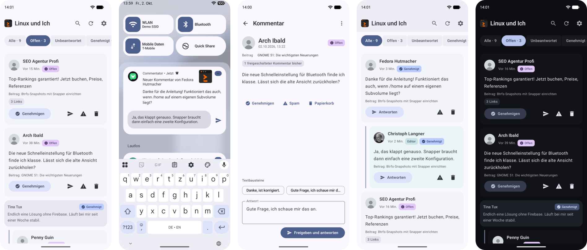

# Commentator

**Moderate your WordPress comments from your phone.**
Approve, reply and get notified – without Google, without a cloud service.

 

Commentator is a free, open source Android app for people who run their own
WordPress blog. It does one job and does it well: going through new comments,
approving or rejecting them, and answering – quickly, from your phone, no
`wp-admin` required. One app for all your blogs.

 

## See it in action

A spam comment is sent to the bin, a new comment arrives within a second,
gets read, approved and answered – and the follow-up question is answered
right from the notification.

[**Watch the 44-second demo**](docs/screenshots/demo-moderation.mp4)

The whole workflow – instant notification, reply, swipe moderation, the
*Unanswered* filter and saved replies – is in the longer video on the
[project page](https://linuxundich.de/projekte/commentator/) (German).

 

## Features

**Moderate in a tap.** Approve, hold, mark as spam or trash – with undo.
Swipe gestures in the list, empty spam and trash with one button, block
senders for good.

**Reply where you are.** Answer from the comment view or straight from the
notification. Replying to a pending comment approves it at the same time.
Saved replies for the answers you type over and over.

**Know what's new.** Notifications with Approve, Reply and Spam buttons, and
they clear themselves once a comment is handled, even if you handled it on
the web. Out of the box, the app checks your blog on its own every 15 minutes
(adjustable) – nothing else needed.

**Optional: instant notifications.** Want new comments within a second? Add
[UnifiedPush](https://unifiedpush.org) with an app like
[ntfy](https://ntfy.sh) – either the free public ntfy.sh or your own
self-hosted server. Still no Google, no Firebase.

**Never miss a question.** The *Unanswered* filter shows every approved
comment your team hasn't replied to yet. Threads show what a reply refers to.

**Spot spam early.** Commentator flags links, duplicate texts and first-time
commenters – and tells you how many comments someone has had approved before.

**All your blogs, one app.** Switch between blogs with a tap; each has its own
notification and team settings, recognisable by its site icon.

**Private by design.** Your phone talks to your blog and nothing else. No
account, no ads, no analytics, no tracking. Credentials are encrypted with the
Android Keystore.

Material 3, dark mode, English and German.

 

## Get started

1. **Install the app.** Download the signed APK from the
   [releases page](https://github.com/linuxundich/commentator/releases) and open
   it on your phone (Android asks once to allow installing from your browser or
   file manager). Updates are manual for now: install the newer APK over the
   old one. Or [build it yourself](docs/guide.md#7-build-the-app).
2. **Connect your blog.** Enter its address, sign in to WordPress in your
   browser and approve – the app receives an
   [application password](https://make.wordpress.org/core/2020/11/05/application-passwords-integration-guide/),
   never your account password.
3. **Optional: install the plugin.** [Commentator Bridge](wordpress-plugin/commentator-bridge)
   enables instant notifications (together with ntfy or another UnifiedPush
   app), faster checks and a few extras like blocking senders. Copy it to `wp-content/plugins/` and activate it.

**Requirements:** Android 8.0 or newer · WordPress 5.6 or newer, served over
HTTPS · an account that may moderate comments (Editor or Administrator).

 

## Documentation

- [Guide](docs/guide.md) – setup, notifications, building, testing
- [Architecture](docs/architecture.md) – how the app is put together
- [Privacy](docs/privacy.md) – every network connection, explained
- [REST API](docs/api.md) – endpoints used, including the plugin's
- [Changelog](CHANGELOG.md) · [Backlog](BACKLOG.md)

 

## On the blog

Commentator has its own page on my blog
[Linux und Ich](https://linuxundich.de/projekte/commentator/) (in German): the
full workflow as a video, screenshots and details on the app and the plugin.
The [project overview](https://linuxundich.de/projekte/) lists everything else
I build for Linux and Android.

## Feedback

Found a bug or have an idea? [Open an issue](https://github.com/linuxundich/commentator/issues).
Commentator is developed by [Christoph Langner](https://www.linuxundich.de)
with the help of AI tools.

## License

[MIT](LICENSE)
